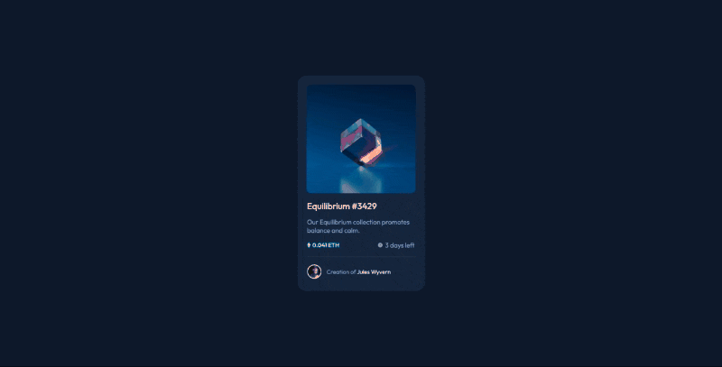

# Frontend Mentor - NFT preview card component solution [22 May 2022]

This is a solution to the [NFT preview card component challenge on Frontend Mentor](https://www.frontendmentor.io/challenges/nft-preview-card-component-SbdUL_w0U). Frontend Mentor challenges help you improve your coding skills by building realistic projects.

## Table of contents

- [Overview](#overview)
  - [The challenge](#the-challenge)
  - [Screenshot](#screenshot)
  - [Links](#links)
- [My process](#my-process)
  - [Built with](#built-with)
  - [What I learned](#what-i-learned)
  - [Continued development](#continued-development)
  - [Useful resources](#useful-resources)
- [Author](#author)
- [Acknowledgments](#acknowledgments)

## Overview

### The challenge

Users should be able to:

- View the optimal layout depending on their device's screen size
- See hover states for interactive elements

### Screenshot

### Links

- Solution URL: [click here](https://www.frontendmentor.io/solutions/nft-preview-card-component-X2tCsUFhc8)
- Live Site URL: [click here](https://its-haanna.github.io/FrontEndMentorChallenges/nft_previev_card/)

## My process

### Built with

- Semantic HTML5 markup
- CSS custom properties
- Flexbox
- Mobile-first workflow

### What I learned

I learned more about CSS and how to apply certain properties to make the design look the way it is supposed to.

### Continued development

I will continue expanding my CSS knowledge so that I can easily apply various styles and make well-designed and accessible websites.

## Author

- Website - [Ha Anna](https://haanna.com)
- Codepen.io - [@haanna](https://codepen.io/haanna)
- Frontend Mentor Profile - [its-haanna](https://www.frontendmentor.io/profile/its-haanna)

## Acknowledgments

Thank you, Frontend Mentor creating this challenge.
