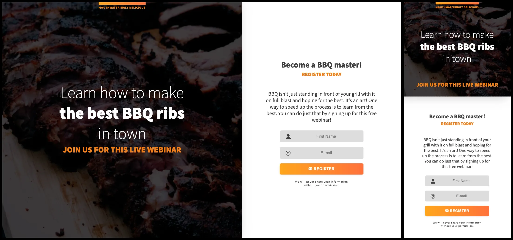

# Responsive Page: BBQ Webinar [16 May 2022]

This project is a part of Scrimba's Responsive Design Module. I made the entire page by looking at high-fidelity wireframes and then build upon the design by choosing hover effects, and coding JavaScript code on my own.

## Table of contents

- [Overview](#overview)
  - [Screenshot](#screenshot)
  - [Links](#links)
- [My process](#my-process)
  - [Built with](#built-with)
  - [What I learned](#what-i-learned)
  - [Continued development](#continued-development)
  - [Useful resources](#useful-resources)
- [Author](#author)
- [Acknowledgments](#acknowledgments)

## Overview

### Screenshot

### Links

- Live Site URL: [BBQ Webinar](https://ha-anna.github.io/Scrimba_Projects/BBQ_Responsive_page/)

## My process

I started from analyzing the wireframes to create an appropriate HTML structure, then moved on to add basic styling. I took a mobile-first approach and upon setting it I moved on to bigger sizes.

### Built with

- Semantic HTML5 markup
- CSS
- Vanilla JavaScript

### What I learned

I learned how to apply mobile-first approach and various CSS styles. It was my first time applying gradient to a border, but after reading a tutorial on how to achieve it, I accomplished it without any issues.

### Continued development

I plan take mobile-first approach in most of my future projects. I will also learn more about `FormData()` to use it more efficiently when creating forms.

### Useful resources

- [Scrimba](https://www.scrimba.com)

## Author

- Website - [Ha Anna](https://haanna.com)
- Codepen - [haanna](https://codepen.io/haanna)

## Acknowledgments

Thank you, Scrimba team for making this challenge.
