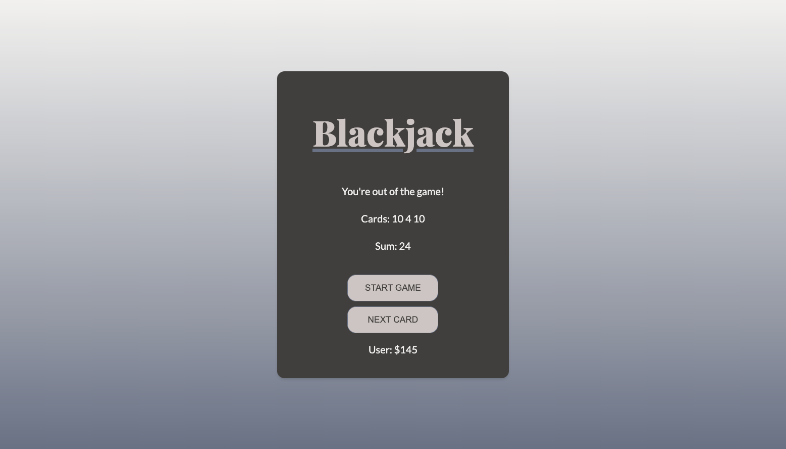

# Blackjack Game [25 April 2022]

This is the first JavaScript game that I made. The rules are: you have to get 21 points to get Blackjack, otherwise you lose or have to draw another card. It's a game based on luck.

## Table of contents

- [Overview](#overview)
  - [Screenshot](#screenshot)
  - [Links](#links)
- [My process](#my-process)
  - [Built with](#built-with)
  - [What I learned](#what-i-learned)
  - [Continued development](#continued-development)
  - [Useful resources](#useful-resources)
- [Author](#author)
- [Acknowledgments](#acknowledgments)

## Overview

### Screenshot

### Links

- Live Site URL: [Blackjack](https://its-haanna.github.io/Scrimba_Projects/Blackjack)

## My process

I began from writing the HTML structure, then moved on to CSS and finally, wrote JavaScript. In JavaScript, I focused on creating functions that will return random numbers between 1 and 12 and then created an if statement that assigns proper points to returned values.
I also added next card button that can only gives another card if the game has begun, the player doesn't have Blackjack yet, and didn't already exceed 21 points.

### Built with

- Semantic HTML5 markup
- CSS
- Vanilla JavaScript

### What I learned

I learned how to use functions and access DOM, as well as how to add Event Listeners.

### Continued development

I want to become more comfortable using JavaScript and build more complex games. In the future, I plan to revisit this code, refactor it and add more functionality.

### Useful resources

- [Scrimba](https://www.scrimba.com)

## Author

- Website - [Ha Anna](https://haanna.com)
- Codepen - [haanna](https://codepen.io/haanna)

## Acknowledgments

Thank you, Scrimba team for making this challenge.
