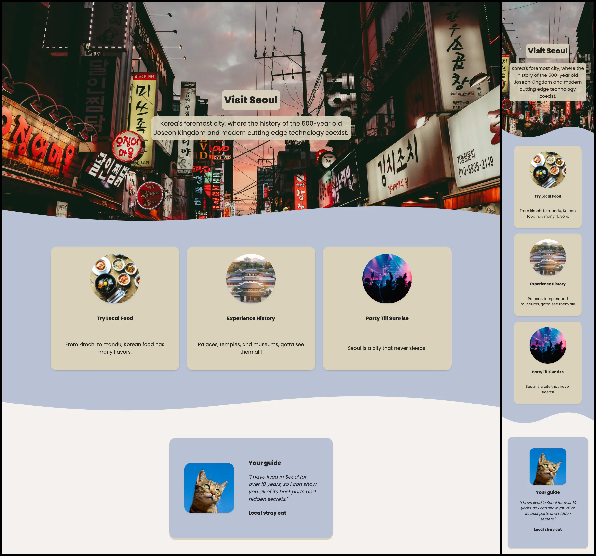

# Responsive Page: Hometown Homepage [6 May 2022]

This solo project is a part of Scrimba's Frontend Developer Career Path.

## Table of contents

- [Overview](#overview)
  - [Screenshot](#screenshot)
  - [Links](#links)
- [My process](#my-process)
  - [Built with](#built-with)
  - [What I learned](#what-i-learned)
  - [Continued development](#continued-development)
  - [Useful resources](#useful-resources)
- [Author](#author)
- [Acknowledgments](#acknowledgments)

## Overview

As a solo project, I created a responsive page about the city I currently live in. I focused on using flexbox and creating a responsive page that can be accessed on both mobile and web.

### Screenshot

### Links

- Live Site URL: [City Homepage: Seoul](https://ha-anna.github.io/Scrimba_Projects/City_homepage/)

## My process

I began from setting the HTMl structure, choosing colors and photos and then adding CSS. I also used SVGs for a smooth photo transition.

### Built with

- Semantic HTML5 markup
- CSS

### What I learned

I strengthened my knowledge of CSS, flexbox and HTML structure.

### Continued development

I will continue making websites that are responsive and can be accessed on various devices. An improvement has to be made on my knowledge of accessibility and how to use aria to make pages screen-reader friendly.

### Useful resources

- [Scrimba](https://www.scrimba.com)
- [Unsplash](https://unsplash.com)
- [Shape Divider](https://www.shapedivider.app/)

## Author

- Website - [Ha Anna](https://haanna.com)
- Codepen - [haanna](https://codepen.io/haanna)

## Acknowledgments

Thank you, Scrimba team for making this challenge.
