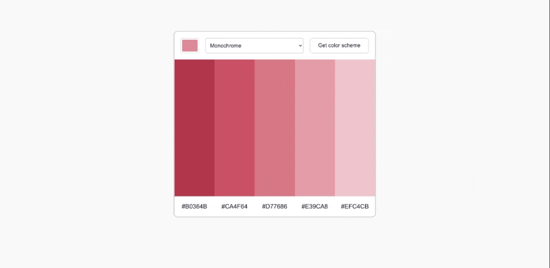

# Color Scheme Generator [24 May 2022]

This solo project is a part of Scrimba's Frontend Developer Career Path.

## Table of contents

- [Overview](#overview)
  - [Screenshot](#screenshot)
  - [Links](#links)
- [My process](#my-process)
  - [Built with](#built-with)
  - [What I learned](#what-i-learned)
  - [Continued development](#continued-development)
  - [Useful resources](#useful-resources)
- [Author](#author)
- [Acknowledgments](#acknowledgments)

## Overview

This is my fourth Solo Project made with JavaScript. The goal was to create a color scheme generator that uses The Color API. When the user chooses the color and the color scheme, a color palette will be generated. The hex colors are also generated and can be copied to the clipboard when clicked, which makes it easy for the user to use it. I also added a function that generates a random monochrome palette when the page is refreshed, to make it more creative and possibly inspire the user.

### Screenshot

### Links

- Live Site URL: [Color Scheme Generator](https://ha-anna.github.io/Scrimba_Projects/Color_scheme_generator/)

## My process

In this project, I was given a design file which I should follow when creating CSS. I began by analyzing the design and setting up the HTML structure. After that, I wrote the CSS and JavaScript. This was my first time working with API on my own, so I also spent some time on analyzing The Color API's documentation.

### Built with

- Semantic HTML5 markup
- CSS
- Vanilla JavaScript
- API: [The Color API](https://www.thecolorapi.com/)

### What I learned

I learned how to fetch API and manipulate it to get the data I want. While working on copying function, I learned about various ways in which we can copy values (`.execCommand('copy')`, deprecated `navigator.clipboard.writeText()` should be used instead).

### Continued development

In the future I will add a function that allows to copy the hex input just by clicking the color displayed. I will also try refactoring the code after some time passes.

### Useful resources

- [Scrimba](https://www.scrimba.com)

## Author

- Website - [Ha Anna](https://haanna.com)
- Codepen - [haanna](https://codepen.io/haanna)

## Acknowledgments

Thank you, Scrimba team for making this challenge.
