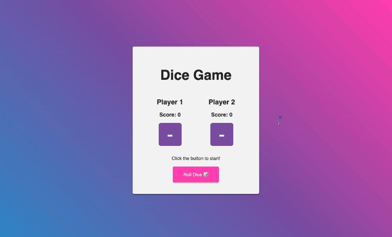

# Dice Game [8 May 2022]

This is a game in which the player who first gets 21 points or more, wins. This project was a part of my learning path where I focused on understanding and applying JavaScript.

## Table of contents

- [Overview](#overview)
  - [Screenshot](#screenshot)
  - [Links](#links)
- [My process](#my-process)
  - [Built with](#built-with)
  - [What I learned](#what-i-learned)
  - [Continued development](#continued-development)
  - [Useful resources](#useful-resources)
- [Author](#author)
- [Acknowledgments](#acknowledgments)

## Overview

### Screenshot

### Links

- Live Site URL: [Dice Game](https://ha-anna.github.io/Scrimba_Projects/Dice_game/)

## My process

### Built with

- Semantic HTML5 markup
- CSS
- Vanilla JavaScript

### What I learned

I developed my design skills when working on this project's CSS. As for JavaScript, I learned more about `classList`, how to manipulate DOM, add and change CSS styles and add animation when firing an event.

### Continued development

In the future I will revisit this code to refactor it and add additional functionality: I plan to make the game more fair so that Player 2 can also begin the game.

### Useful resources

- [Scrimba](https://www.scrimba.com)

## Author

- Website - [Ha Anna](https://haanna.com)
- Codepen - [haanna](https://codepen.io/haanna)

## Acknowledgments

Thank you, Scrimba team for making this challenge.
