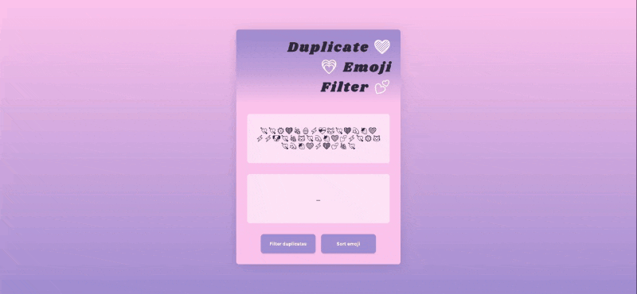

# Duplicate Emoji Filter [12 May 2022]

This project is a part of [Scrimba Challenge Weeks](https://scrimba.com/learn/codeweeks) and shows my solution to the given task.

## Table of contents

- [Overview](#overview)
  - [Screenshot](#screenshot)
  - [Links](#links)
- [My process](#my-process)
  - [Built with](#built-with)
  - [What I learned](#what-i-learned)
  - [Continued development](#continued-development)
  - [Useful resources](#useful-resources)
- [Author](#author)
- [Acknowledgments](#acknowledgments)

## Overview

The goal was to filter out all duplicate emoji, leaving only one of each emoji and render them in the filed below. I also completed the stretch goal to sort all the emoji by type and render them.

### Screenshot

### Links

- Live Site URL: [Duplicate Emoji Filter](https://ha-anna.github.io/Scrimba_Projects/Duplicate_emoji_filter/)

## My process

First, I started by tweaking HTMl and creating a design that I like with CSS. Then I began working on JavaScript.

### Built with

- Semantic HTML5 markup
- CSS
- Vanilla JavaScript

### What I learned

Through this challenge, I practiced using `...` spread operator, `.join()` an `.sort()`.

### Continued development

My goal is to complete all the Scrimba Challenge Week Projects and have a strong understanding of JavaScript.

### Useful resources

- [Scrimba](https://www.scrimba.com)

## Author

- Website - [Ha Anna](https://haanna.com)
- Codepen - [haanna](https://codepen.io/haanna)

## Acknowledgments

Thank you, Scrimba team for making this challenge.
