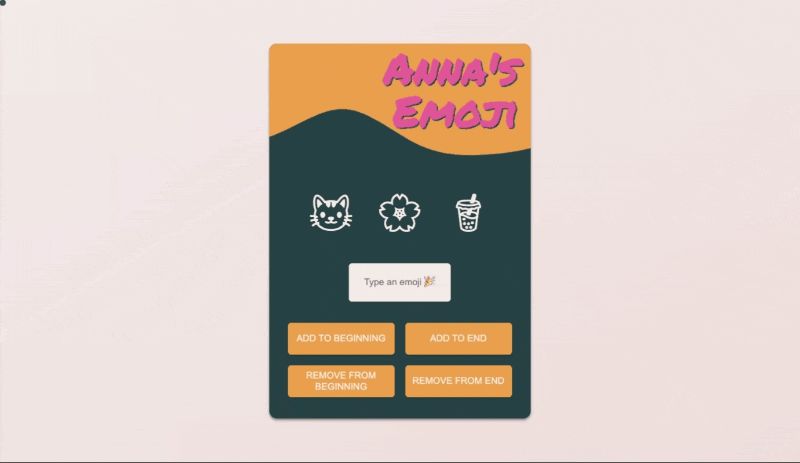

# Emoji Tool [6 May 2022]

This project is a part of [Scrimba's Frontend Developer Career Path](https://scrimba.com/learn/frontend).

## Table of contents

- [Overview](#overview)
  - [Screenshot](#screenshot)
  - [Links](#links)
- [My process](#my-process)
  - [Built with](#built-with)
  - [What I learned](#what-i-learned)
  - [Continued development](#continued-development)
  - [Useful resources](#useful-resources)
- [Author](#author)
- [Acknowledgments](#acknowledgments)

## Overview

### Screenshot

### Links

- Live Site URL: [Emoji Tool](https://its-haanna.github.io/Scrimba_Projects/Emoji_tool/)

## My process

I began by creating the HTML structure, choosing fonts, colors and design and implementing it with CSS. Then, I wrote JavaScript that allows the user to add and remove emoji to the beginning or the end of the line. I used Noto's emoji font and SVG made by Shape Divider App.

### Built with

- Semantic HTML5 markup
- CSS
- Vanilla JavaScript

### What I learned

I practiced using `.unshift()`, `.shift()`, `.pop()` and `.push()`, adding Event Listeners and manipulating DOM.

### Continued development

In the future, I will try refactoring this code to make it even more readable and human-friendly.

### Useful resources

- [Scrimba](https://www.scrimba.com)
- [Shape Divider](https://www.shapedivider.app/)

## Author

- Website - [Ha Anna](https://haanna.com)
- Codepen - [haanna](https://codepen.io/haanna)

## Acknowledgments

Thank you, Scrimba team for making this challenge.
