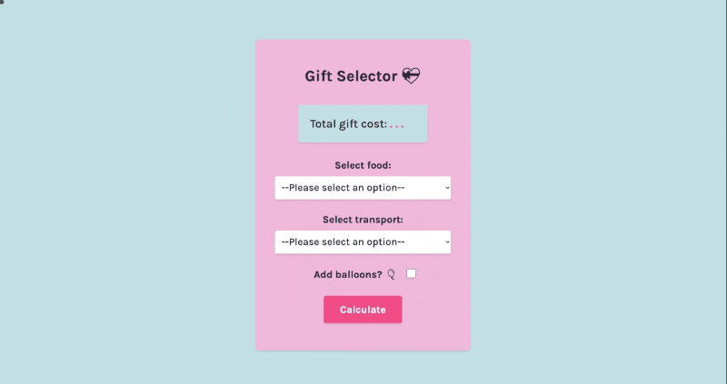

# Gift Selector [2 May 2022]

This project is a part of [Scrimba Challenge Weeks](https://scrimba.com/learn/codeweeks) and shows my solution to the given task.

## Table of contents

- [Overview](#overview)
  - [Screenshot](#screenshot)
  - [Links](#links)
- [My process](#my-process)
  - [Built with](#built-with)
  - [What I learned](#what-i-learned)
  - [Continued development](#continued-development)
  - [Useful resources](#useful-resources)
- [Author](#author)
- [Acknowledgments](#acknowledgments)

## Overview

In this project, you can calculate the price of the gift together with the delivery fee. You can also add balloons to your order and calculate the new price. After clicking 'Calculate' button, the page will inform you how much everything costs. Moreover, I coded it in a way that requires the user to select both food and transport before it returns the final cost.

### Screenshot

### Links

- Live Site URL: [Valentine's Gift Selector](https://ha-anna.github.io/Scrimba_Projects/Gift_Selector/)

## My process

First, I started by tweaking HTMl and creating a design that I like with CSS. Then I began working on JavaScript.

### Built with

- Semantic HTML5 markup
- CSS
- Vanilla JavaScript

### What I learned

I practiced using `if` statements, manipulating and getting values from DOM, creating functions and Event Listeners.

### Continued development

In the future I'd like to improve the design of this project and make it more personal, as well as add a bigger variety of options. Especially, I'd like to improve the code so that the cost updates automatically if balloons option is chosen later, after already calculating the price.

### Useful resources

- [Scrimba](https://www.scrimba.com)

## Author

- Website - [Ha Anna](https://haanna.com)
- Codepen - [haanna](https://codepen.io/haanna)

## Acknowledgments

Thank you, Scrimba's team for making this challenge.
