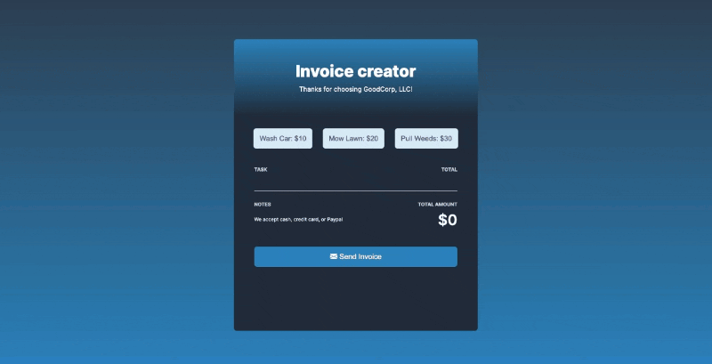

# Invoice Creator [4 May 2022]

This solo project is a part of Scrimba's [Frontend Developer Career Path](https://scrimba.com/learn/frontend).

## Table of contents

- [Overview](#overview)
  - [Screenshot](#screenshot)
  - [Links](#links)
- [My process](#my-process)
  - [Built with](#built-with)
  - [What I learned](#what-i-learned)
  - [Continued development](#continued-development)
  - [Useful resources](#useful-resources)
- [Author](#author)
- [Acknowledgments](#acknowledgments)

## Overview

This is my third Solo Project made with JavaScript. The goal was to create an invoice creator, that would allow adding and deleting available tasks and "send" the invoice. Moreover, as elements are added or removed from the invoice, the final price is calculated and updated. Another goal was to block the user from adding any task more than once.

### Screenshot

### Links

- Live Site URL: [Invoice Creator](https://its-haanna.github.io/Scrimba_Projects/Invoice_creator/)

## My process

In this project, I was given a design file which I should follow when creating CSS. I began by analyzing the design and setting up the HTML structure. After that, I wrote the CSS and JavaScript.

### Built with

- Semantic HTML5 markup
- CSS
- Vanilla JavaScript

### What I learned

In this project, I practiced using and accessing objects, adding and removing Event Listeners and creating functions.

### Continued development

In the future, I plan to refactor this code to make it more human-friendly and declarative. This code has issues when it comes to DRY (don't repeat yourself) that I want to fix. Another goal is to create a dark/light mode for it.

### Useful resources

- [Scrimba](https://www.scrimba.com)

## Author

- Website - [Ha Anna](https://haanna.com)
- Codepen - [haanna](https://codepen.io/haanna)

## Acknowledgments

Thank you, Scrimba team for making this challenge.
