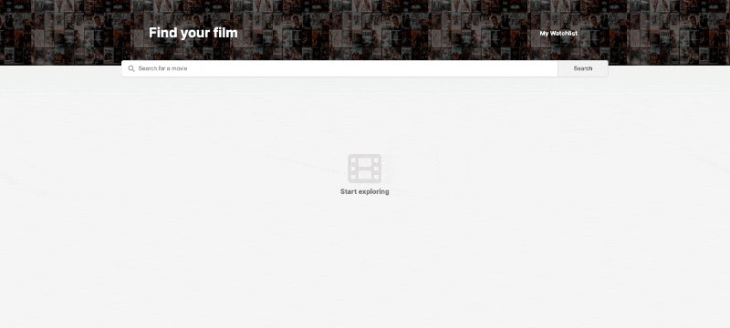

# Unit Converter [29 May 2022]

This solo project is a part of Scrimba's [Frontend Developer Career Path](https://scrimba.com/learn/frontend).

## Table of contents

- [Overview](#overview)
  - [Screenshot](#screenshot)
  - [Links](#links)
- [My process](#my-process)
  - [Built with](#built-with)
  - [What I learned](#what-i-learned)
  - [Continued development](#continued-development)
  - [Useful resources](#useful-resources)
- [Author](#author)
- [Acknowledgments](#acknowledgments)

## Overview

This is yet another Solo Project that I completed fom start to finish. The goal here was to create a database that will take user's query and return matching results. When returning the results, a list of movie cards that display certain data (Title, Poster, Runtime, Rating, Description, Genre) is generated.
The user has an option of adding to or removing the movie from their Watchlist and reviewing the list whenever they wish.The page communicates with Browser's local storage to store the list and update it whenever necessary. It is also coded in case of incorrect input or empty input.

Movie Watchlist is fully responsive and can be used on mobile and laptop.

### Screenshot

### Links

- Live Site URL: [Movie Watchlist](https://its-haanna.github.io/Scrimba_Projects/Movie_watchlist)

## My process

In this project, I was given a design file which I should follow when creating CSS. I began by analyzing the design and setting up the HTML structure. After that, I wrote the CSS and JavaScript.

### Built with

- Semantic HTML5 markup
- CSS
- Vanilla JavaScript
- [OMDb API](https://www.omdbapi.com/)

### What I learned

### Continued development

This code needs to be made more dry so it is schedule to be revised in a week or two. I plan to implement what I have learnt here in my future projects.

### Useful resources

- [Scrimba](https://www.scrimba.com)

## Author

- Website - [Ha Anna](https://haanna.com)
- Codepen - [haanna](https://codepen.io/haanna)

## Acknowledgments

Thank you, Scrimba team for making this challenge.
