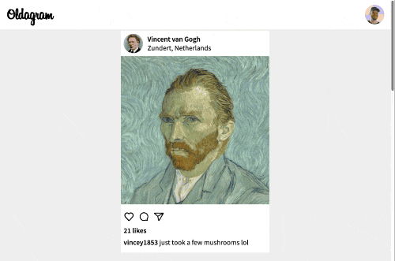

# Oldagram [19 July 2022]

This project is a part of Scrimba's Frontend Developer Career Path. It was added to the Path later but I decided to complete it since it's looks like a fun project to practice my JS, CSS and HTML skills with.

## Table of contents

- [Overview](#overview)
  - [Screenshot](#screenshot)
  - [Links](#links)
- [My process](#my-process)
  - [Built with](#built-with)
  - [What I learned](#what-i-learned)
  - [Continued development](#continued-development)
  - [Useful resources](#useful-resources)
- [Author](#author)
- [Acknowledgments](#acknowledgments)

## Overview

### Screenshot

### Links

- Live Site URL: [Oldagram](https://ha-anna.github.io/Scrimba_Projects/Oldagram/)

## My process

### Built with

- Semantic HTML5 markup
- CSS
- Vanilla JavaScript

### What I learned

### Continued development

### Useful resources

- [Scrimba](https://www.scrimba.com)

## Author

- Website - [Ha Anna](https://haanna.com)
- Codepen - [haanna](https://codepen.io/haanna)

## Acknowledgments

Thank you, Scrimba team for making this challenge.
