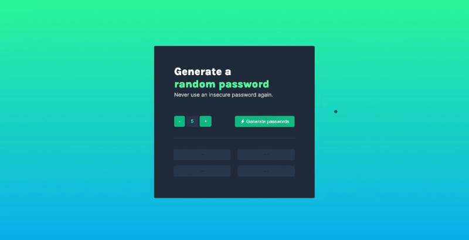

# Password Generator [30 April 2022]

This solo project is a part of Scrimba's [Frontend Developer Career Path](https://scrimba.com/learn/frontend).

## Table of contents

- [Overview](#overview)
  - [Screenshot](#screenshot)
  - [Links](#links)
- [My process](#my-process)
  - [Built with](#built-with)
  - [What I learned](#what-i-learned)
  - [Continued development](#continued-development)
  - [Useful resources](#useful-resources)
- [Author](#author)
- [Acknowledgments](#acknowledgments)

## Overview

This is my second Solo Project made with JavaScript, adn I have to admit, it is the project that brought me the most fun. The goal of this project was to create a password generator that generates four random passwords when the button is clicked.
Other functions:

- allows the user to choose the length of the password (5-12 characters)
- copy the password when the input is clicked
- informs the user that the password was copied
- informs the user to first click "generate" button if you ty to copy the password when the field is empty

### Screenshot

### Links

- Live Site URL: [Password Generator](https://ha-anna.github.io/Scrimba_Projects/Password_generator/)

## My process

In this project, I was given a design file which I should follow when creating CSS. I began by analyzing the design and setting up the HTML structure. After that, I wrote the CSS and JavaScript.

### Built with

- Semantic HTML5 markup
- CSS
- Vanilla JavaScript

### What I learned

While working on this project, I learned a lot about CSS and HTML structure, and also how to access and manipulate input's values. I also practiced changing CSS styles with JavaScript, add Event Listeners, use `Math.random()`, various string methods and `for` loops.

### Continued development

In the future I'd like to add a function that lets the user choose if they want numbers and special characters to appear in their password or not.

### Useful resources

- [Scrimba](https://www.scrimba.com)

## Author

- Website - [Ha Anna](https://haanna.com)
- Codepen - [haanna](https://codepen.io/haanna)

## Acknowledgments

Thank you, Scrimba team for making this challenge.
