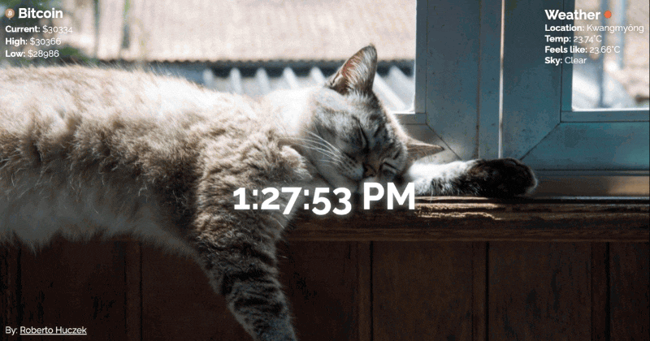

# Personal Dashboard [30 May 2022]

This project is a part of Scrimba's Frontend Developer Career Path.

## Table of contents

- [Overview](#overview)
  - [Screenshot](#screenshot)
  - [Links](#links)
- [My process](#my-process)
  - [Built with](#built-with)
  - [What I learned](#what-i-learned)
  - [Continued development](#continued-development)
  - [Useful resources](#useful-resources)
- [Author](#author)
- [Acknowledgments](#acknowledgments)

## Overview

### Screenshot

### Links

- Live Site URL: [Personal Dashboard](https://its-haanna.github.io/Scrimba_Projects/Personal_dashboard/)

## My process

### Built with

- Semantic HTML5 markup
- SASS
- Mobile-first workflow
- Vanilla JavaScript
- API (Geolocation, Cryptocurrency, Unsplash)

### What I learned

I learned how to create and deploy a Chrome extension, use various APIs, create a working clock, and get current location from the user.

### Continued development

I plan to personalize this extension in a near future. I want to add a function to add todos and exchange bitcoin part of the extension with something more my style, such as geek jokes or interesting facts.

### Useful resources

- [Scrimba](https://www.scrimba.com)

## Author

- Website - [Ha Anna](https://haanna.com)

## Acknowledgments

Thank you, Scrimba #scrimba-pets channel for the inspiration, as well as other Scrimba's students for their reviews and opinions.
