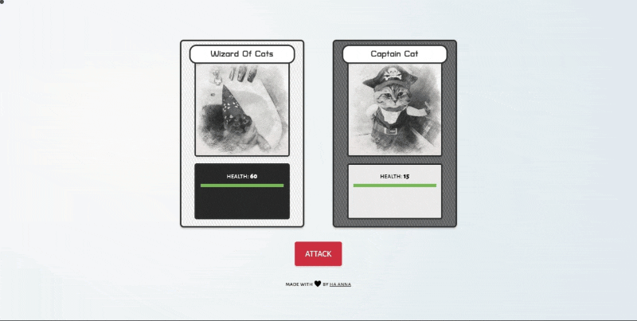

# Role-playing Game - The Game of Cats

This is a role-playing game in which you, Wizard of Cats, are up against great villains: Captain Cat, Wild West Catboy, and Cleopawtra. Each roll of the dice equals the damage received and given. Try your best to be victorious.

## Table of contents

- [Overview](#overview)
  - [Screenshot](#screenshot)
  - [Links](#links)
- [My process](#my-process)
  - [Built with](#built-with)
  - [What I learned](#what-i-learned)
  - [Continued development](#continued-development)
  - [Useful resources](#useful-resources)
- [Author](#author)
- [Acknowledgments](#acknowledgments)

## Overview

### Screenshot

### Links

- Live Site URL: [The Game of Cats](https://its-haanna.github.io/Scrimba_Projects/Roleplaying_game/)

## My process

### Built with

- Semantic HTML5 markup
- CSS
- Mobile-first workflow
- Vanilla JavaScript

### What I learned

Through this project, I gained a better understanding of `.map()`, `Class`, `setTimeout()`, and `.fill()`. I was also able to use my design skills and CSS skills to make the hero and monster cards resemble trading cards from my childhood.

### Continued development

I want to become more comfortable using JS Classes and modules. Moreover, I want to work further on the animation when a new character appears so that the transition is smooth and seamless.

### Useful resources

- [Scrimba](https://www.scrimba.com)
- [Transparent Textures](https://www.transparenttextures.com/)

## Author

- Website - [Ha Anna](https://haanna.com)

## Acknowledgments

Thank you, Scrimba #scrimba-pets channel for the inspiration, as well as other Scrimba's students for their reviews and opinions.
