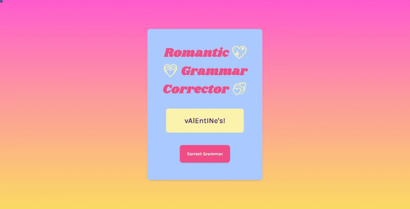

# Romantic Gift Selector [12 May 2022]

This project is a part of [Scrimba Challenge Weeks](https://scrimba.com/learn/codeweeks) and shows my solution to the given task.

## Table of contents

- [Overview](#overview)
  - [Screenshot](#screenshot)
  - [Links](#links)
- [My process](#my-process)
  - [Built with](#built-with)
  - [What I learned](#what-i-learned)
  - [Continued development](#continued-development)
  - [Useful resources](#useful-resources)
- [Author](#author)
- [Acknowledgments](#acknowledgments)

## Overview

In this challenge, the goal was to take the strangely spelled text and turn it into a properly capitalized text.

### Screenshot

### Links

- Live Site URL: [Romantic Grammar Corrector](https://ha-anna.github.io/Scrimba_Projects/Romantic_Grammar_Corrector/)

## My process

First, I started by tweaking HTMl and creating a design that I like with CSS. Then I began working on JavaScript.

### Built with

- Semantic HTML5 markup
- CSS
- Vanilla JavaScript

### What I learned

I learned how to manipulate DOM and use `.slice()` and `.charAt()`.

### Continued development

I intend to keep expanding my JavaScript and front-end knowledge. In the future, I would like to expand it and build a project in which not only single word but entire sentences are fixed.

### Useful resources

- [Scrimba](https://www.scrimba.com)

## Author

- Website - [Ha Anna](https://haanna.com)
- Codepen - [haanna](https://codepen.io/haanna)

## Acknowledgments

Thank you, Scrimba team for making this challenge.
