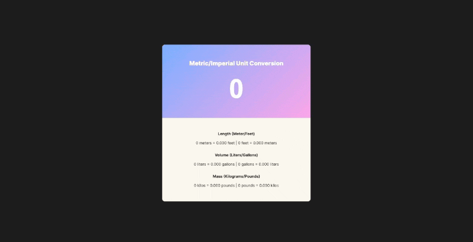

# Unit Converter [8 April 2022]

This solo project is a part of Scrimba's [Frontend Developer Career Path](https://scrimba.com/learn/frontend).

## Table of contents

- [Overview](#overview)
  - [Screenshot](#screenshot)
  - [Links](#links)
- [My process](#my-process)
  - [Built with](#built-with)
  - [What I learned](#what-i-learned)
  - [Continued development](#continued-development)
  - [Useful resources](#useful-resources)
- [Author](#author)
- [Acknowledgments](#acknowledgments)

## Overview

This is the first Solo Project in which I was using JavaScript. The goal was to create a unit converter, that takes a numerical input and converts it to different values (meters/feet, liters/gallons, kilograms/pounds).

### Screenshot

### Links

- Live Site URL: [Unit Converter](https://ha-anna.github.io/Scrimba_Projects/Unit_converter/)

## My process

In this project, I was given a design file which I should follow when creating CSS. I began by analyzing the design and setting up the HTML structure. After that, I wrote the CSS and JavaScript.

### Built with

- Semantic HTML5 markup
- CSS
- Vanilla JavaScript

### What I learned

I learned how to use linear-gradients, use flex box, and create inputs. As for JavaScript, I practiced using `.toFixed()`, functions, Event Listeners and `for... in` loops.

### Continued development

This project's JvaScript code has been already refactored once. I do not plan to work on it more, but I will occasionally return to the code to revise it.

### Useful resources

- [Scrimba](https://www.scrimba.com)

## Author

- Website - [Ha Anna](https://haanna.com)
- Codepen - [haanna](https://codepen.io/haanna)

## Acknowledgments

Thank you, Scrimba team for making this challenge.
