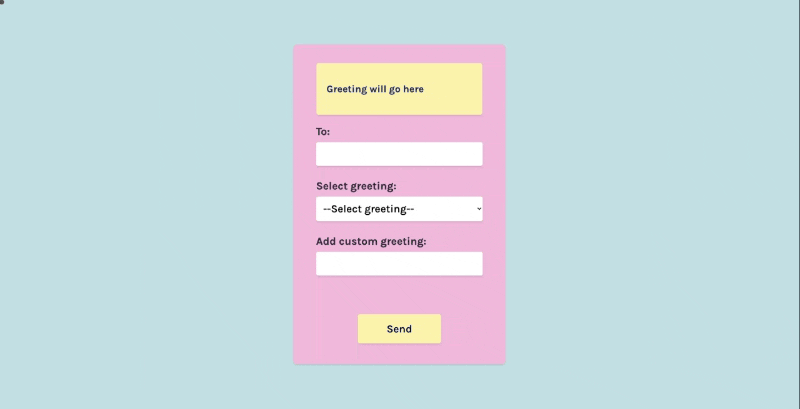

# Valentine Greeting [3 May 2022]

This project is a part of [Scrimba Challenge Weeks](https://scrimba.com/learn/codeweeks) and shows my solution to the given task.

## Table of contents

- [Overview](#overview)
  - [Screenshot](#screenshot)
  - [Links](#links)
- [My process](#my-process)
  - [Built with](#built-with)
  - [What I learned](#what-i-learned)
  - [Continued development](#continued-development)
  - [Useful resources](#useful-resources)
- [Author](#author)
- [Acknowledgments](#acknowledgments)

## Overview

In this challenge, the goal was to create an app that will allow you to put the name of the person you want to send your greeting to, choose your message or write your own, sign it with your name and after clicking 'Send' button to show all the inputs combined into a message. I added some additional functions such as combining both choices to make the message more personal and showing the "From" field only after "To" field has an input.

### Screenshot

### Links

- Live Site URL: [Valentine's Greeting](https://ha-anna.github.io/Scrimba_Projects/Valentine_Greeting/)

## My process

First, I started by tweaking HTMl and creating a design that I like with CSS. Then I began working on JavaScript.

### Built with

- Semantic HTML5 markup
- CSS
- Vanilla JavaScript

### What I learned

Through this project, I learned how to make certain elements of HTML disappear with JS, and how to combine different types of inputs into one text.

### Continued development

In the future, I'd like to revisit this app to make the CSS more responsible and personal and also to refactor JavaScript and add other functions to it.

### Useful resources

- [Scrimba](https://www.scrimba.com)

## Author

- Website - [Ha Anna](https://haanna.com)
- Codepen - [haanna](https://codepen.io/haanna)

## Acknowledgments

Thank you, Scrimba team for making this challenge.
