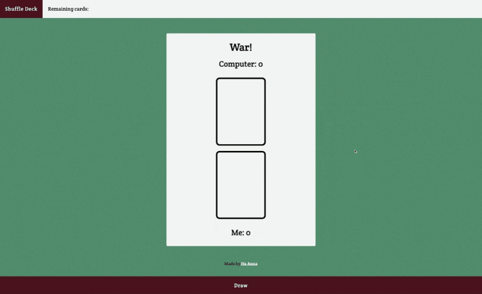

# War - Card Game [27 May 2022]

This solo project is a part of Scrimba's Frontend Developer Career Path.

## Table of contents

- [Overview](#overview)
  - [Screenshot](#screenshot)
  - [Links](#links)
- [My process](#my-process)
  - [Built with](#built-with)
  - [What I learned](#what-i-learned)
  - [Continued development](#continued-development)
  - [Useful resources](#useful-resources)
- [Author](#author)
- [Acknowledgments](#acknowledgments)

## Overview

### Screenshot

### Links

- Live Site URL: [War - Card Game](https://its-haanna.github.io/Scrimba_Projects/War_card_game/)

## My process

This project was made step by step by completing challenges from the teacher. I decided to use SASS instead of CSS to practice what I've learned the day before. I started by creating HTML structure, writing SASS and then working on JavaScript.

### Built with

- Semantic HTML5 markup
- SASS
- Vanilla JavaScript
- API: [Deck Of Cards](https://deckofcardsapi.com/)
- [Transparent Textures](https://www.transparenttextures.com/)

### What I learned

With this project I practiced using APIs, writing async/await functions and applying logic to make the game work as intended.

### Continued development

After some time, I will refactor this code and possibly add more features to make it more interesting.

### Useful resources

- [Scrimba](https://www.scrimba.com)

## Author

- Website - [Ha Anna](https://haanna.com)
- Codepen - [haanna](https://codepen.io/haanna)

## Acknowledgments

Thank you, Scrimba team for making this challenge.
