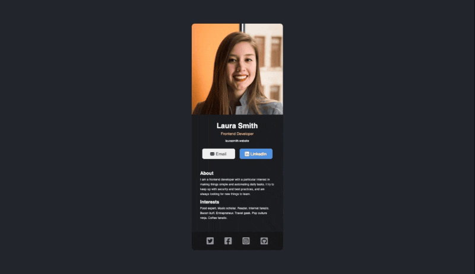

# Business Card [6 June 2022]

This project is a part of Scrimba's Frontend Developer Career Path.

## Table of contents

- [Overview](#overview)
  - [Screenshot](#screenshot)
  - [Links](#links)
- [My process](#my-process)
  - [Built with](#built-with)
  - [What I learned](#what-i-learned)
  - [Continued development](#continued-development)
  - [Useful resources](#useful-resources)
- [Author](#author)
- [Acknowledgments](#acknowledgments)

## Overview

This was my first solo React project after starting to learn React. The goal was to create a static site based on the figma design that was provided.

### Screenshot

### Links

- Live Site URL: [Business Card](https://business-card-react-six.vercel.app/)

## My process

I started from setting up my files with Create React App and moved on to plan out components and files. Then I rendered all the HTML with `ReactDOM.render()` and styled it.

### Built with

- Semantic HTML5 markup
- CSS
- Mobile-first workflow
- React

### What I learned

I learned the basics of React: what JSX is, how to create and organise components, import and export things between files (although I already knew how to do that in JS), how to style my HTML with className, and how to set up my projects locally!

### Continued development

I will keep learning React to create reusable, interactive apps.

### Useful resources

- [Scrimba](https://www.scrimba.com)

## Author

- Website - [Ha Anna](https://haanna.com)

## Acknowledgments

Thank you, Scrimba #scrimba-pets channel for the inspiration, as well as other Scrimba's students for their reviews and opinions.
