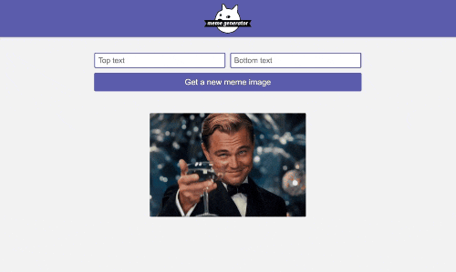

# Meme Generator [24 June 2022]

This project is a part of Scrimba's Frontend Developer Career Path.

## Table of contents

- [Overview](#overview)
  - [Screenshot](#screenshot)
  - [Links](#links)
  - [Features](#features)
- [My process](#my-process)
  - [Built with](#built-with)
  - [What I learned](#what-i-learned)
  - [Continued development](#continued-development)
  - [Useful resources](#useful-resources)
- [Author](#author)
- [Acknowledgments](#acknowledgments)

## Overview

### Screenshot

### Links

- Live Site URL: [Meme Generator](https://react-meme-generator-liart.vercel.app/)

### Features

- shuffle through various meme images
- add top and bottom text of your choice

## My process

I started from setting the project, creating he logo and writing CSS. AFter that, I worked on adding functionality and making sure everything works and is responsive and accessible.

### Built with

- CSS
- React

### What I learned

How to organize my code, fetch data from API and take care of side effects. I've also learned about how to create basic forms and manage their state.

### Continued development

This project is in its final form and for now there are no plans for adding any other functionality.

### Useful resources

- [Scrimba](https://www.scrimba.com)

## Author

- Website - [Ha Anna](https://haanna.com)

## Acknowledgments

Thank you, Scrimba #scrimba-pets channel for the inspiration, as well as other Scrimba's students for their reviews and opinions.
