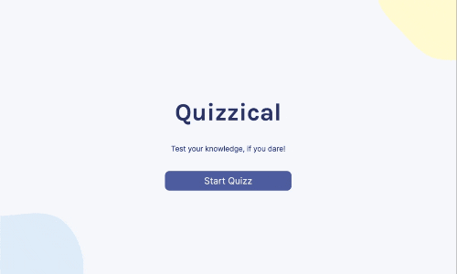

# Quizzical [13 July 2022]

This project is a part of Scrimba's Frontend Developer Career Path.

## Table of contents

- [Overview](#overview)
  - [Screenshot](#screenshot)
  - [Links](#links)
  - [Features](#features)
- [My process](#my-process)
  - [Built with](#built-with)
  - [What I learned](#what-i-learned)
  - [Continued development](#continued-development)
  - [Useful resources](#useful-resources)
- [Author](#author)
- [Acknowledgments](#acknowledgments)

## Overview

In this solo project, I was able to practice everything that I've learned about React and create a fun and engaging app. Quizzical displays 10 questions with 4 answers each, and the user has to choose one. When checking the answers, green communicates correct choice while red incorrect one. Additionally, if the choice was incorrect, the correct answer gets highlighted in blue. The points are counted and displayed for easy check.

### Screenshot

### Links

- Live Site URL: [Quizzical](https://react-quizzical.vercel.app/)

### Features

- displaying quiz questions based on category and difficulty
- check if the answers the user chose are correct
- displaying correct answers
- counting points
- letting the user start a new game

## My process

I have started by looking at figma files and writing down the possible routes I can take in terms of setting up my components. I've also planned what should the components focus on and accomplish. Then, I started setting up CSS and `Intro.jsx`. After that, I focused on `Settings.jsx` and fetching the data. The next step was creating `Questions.jsx` component that the fetched data has to be passed to. At that point, I spent a long time planning how to code `Answers.jsx` component. I wanted to make sure I can check the player's choice, correct answers and create interactive styles that change when certain criteria are met. After all of this was set up, I created a function that checks the answers and counts the points. As a final touch, I checked whether the responsiveness and accessibility is okay.

### Built with

- CSS
- React
- npm (normalize.css, shuffleArray, nanoid)

### What I learned

This project was a really tough nut to crack but with persistence and review, I have succeeded. It was also an amazing lesson and review, which further strengthened my react knowledge and taught me how to deal with state and components.

### Continued development

The code will need additional refactoring to make it cleaner and more DRY.

### Useful resources

- [Scrimba](https://www.scrimba.com)
- [Patternpad](https://patternpad.com/)

## Author

- Website - [Ha Anna](https://haanna.com)

## Acknowledgments

Thank you, Scrimba, for being an awesome place to learn.
