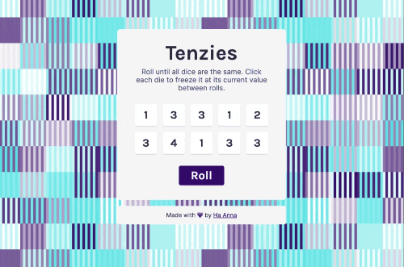

# Tenzies Game [8 July 2022]

This project is a part of Scrimba's Frontend Developer Career Path.

## Table of contents

- [Overview](#overview)
  - [Screenshot](#screenshot)
  - [Links](#links)
  - [Features](#features)
- [My process](#my-process)
  - [Built with](#built-with)
  - [What I learned](#what-i-learned)
  - [Continued development](#continued-development)
  - [Useful resources](#useful-resources)
- [Author](#author)
- [Acknowledgments](#acknowledgments)

## Overview

With this project, the goal was to practice using `useState()`, `props`, and `useEffect()`.

### Screenshot

### Links

- Live Site URL: [Tenzies Game](https://react-tenzies-game.vercel.app/)

### Features

- rolling randomized dice
- holding dice from being rolled
- starting new game when certain conditions are met

## My process

First, I started from setting up my project, and writing HTML and CSS. Next, I worked on adding functionality (randomizing dice values, rolling the numbers, holding the dice from rolling, confetti, etc). Finally, I checked the design looks cross-browser, added normalize.css and improved CSS.

### Built with

- CSS
- React
- npm (normalize.css, react-confetti)

### What I learned

I became more comfortable using `useEffect()`, understanding how to set state, and just thinking in terms of how to separate functionality and make my code cleaner.

### Continued development

I will be adding additional functionality:

1. putting real dots on the dice (CSS)
2. tracking number of rolls
3. tracking the tme it took to win
4. saving your best time to localStorage

### Useful resources

- [Scrimba](https://www.scrimba.com)
- [Patternpad](https://patternpad.com/)

## Author

- Website - [Ha Anna](https://haanna.com)

## Acknowledgments

Thank you, Scrimba, for being an awesome place to learn.
