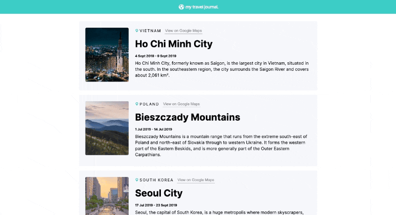

# Travel Journal [8 June 2022]

This project is a part of Scrimba's Frontend Developer Career Path.

## Table of contents

- [Overview](#overview)
  - [Screenshot](#screenshot)
  - [Links](#links)
- [My process](#my-process)
  - [Built with](#built-with)
  - [What I learned](#what-i-learned)
  - [Continued development](#continued-development)
  - [Useful resources](#useful-resources)
- [Author](#author)
- [Acknowledgments](#acknowledgments)

## Overview

This was my second React solo project. The goal was to create a travel journal app that renders cards from imported data and displays them on the page. This project is supposed to be done alone from the scratch.

### Screenshot

### Links

- Live Site URL: [Travel Journal](https://react-travel-journal-one.vercel.app/)

## My process

I started from setting up my files with Create React App and moved on to plan out components and files. I created a card component and my own data file. Then I used props to map the data into every card. Then I rendered all the HTML with `ReactDOM.render()` and styled it.

### Built with

- Semantic HTML5 markup
- CSS
- Mobile-first workflow
- React

### What I learned

I have practiced using props, creating reusable components, and using React. I also got to play around with media queries and CSS, which allowed me to personalize the page and make it responsive.

### Continued development

As I travel I will try adding more locations and maybe think of adding additional props.

### Useful resources

- [Scrimba](https://www.scrimba.com)

## Author

- Website - [Ha Anna](https://haanna.com)

## Acknowledgments

Thank you, Scrimba #scrimba-pets channel for the inspiration, as well as other Scrimba's students for their reviews and opinions.
